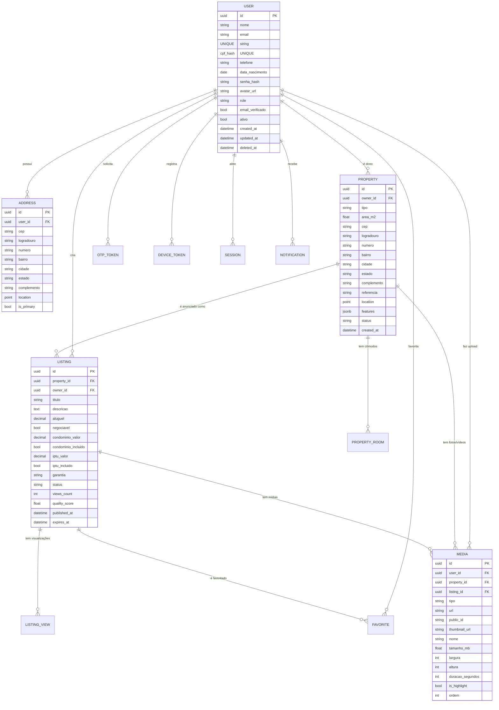

# 🐍 SPEC KIT DJANGO — Backend Mobile Aluguel360
## FASE 2 de 4: Modelos, Schema do Banco de Dados e Migrações

> **REFLEXÃO ANTES DE IMPLEMENTAR:**
> Esta fase define o coração do sistema. Erros aqui são os mais custosos de corrigir.
> Pontos críticos desta fase:
> 1. O Custom User Model DEVE ser o primeiro a ser criado. Nunca use o User padrão do Django.
> 2. UUID como primary key em todos os models (escalabilidade, sem exposição de IDs sequenciais).
> 3. Soft delete em User, Property e Listing (LGPD — dados não podem ser destruídos imediatamente).
> 4. Campos de geolocalização com PostGIS para busca por proximidade futura.
> 5. Separar `Property` (entidade física) de `Listing` (publicação/anúncio) — um imóvel pode ter múltiplos anúncios ao longo do tempo.

---

## 📊 DIAGRAMA ER COMPLETO



---

## 🗃️ APP: `users` — Modelos

### `apps/users/models.py`

```python
# apps/users/models.py

import uuid
import hashlib
from django.contrib.auth.models import AbstractBaseUser, PermissionsMixin, BaseUserManager
from django.contrib.gis.db import models as gis_models
from django.db import models
from django.utils import timezone


class UserRole(models.TextChoices):
    INQUILINO = 'INQUILINO', 'Inquilino'
    PROPRIETARIO = 'PROPRIETARIO', 'Proprietário'
    ADMIN = 'ADMIN', 'Administrador'


class UserManager(BaseUserManager):
    """Manager customizado para User com email como identificador."""

    def create_user(self, email, nome, cpf, senha=None, **extra_fields):
        if not email:
            raise ValueError('O email é obrigatório')
        if not cpf:
            raise ValueError('O CPF é obrigatório')
        email = self.normalize_email(email)
        user = self.model(email=email, nome=nome, cpf=cpf, **extra_fields)
        user.set_password(senha)
        user.save(using=self._db)
        return user

    def create_superuser(self, email, nome, cpf, senha=None, **extra_fields):
        extra_fields.setdefault('is_staff', True)
        extra_fields.setdefault('is_superuser', True)
        extra_fields.setdefault('role', UserRole.ADMIN)
        return self.create_user(email, nome, cpf, senha, **extra_fields)


class User(AbstractBaseUser, PermissionsMixin):
    """
    Custom User Model — NUNCA use o User padrão do Django neste projeto.
    AUTH_USER_MODEL = 'users.User' já está configurado no settings.
    
    CPF é armazenado como hash SHA-256 para garantir unicidade sem expor o dado.
    O CPF real só trafega criptografado via HTTPS e nunca é armazenado em plain text.
    """

    id = models.UUIDField(primary_key=True, default=uuid.uuid4, editable=False)
    nome = models.CharField(max_length=200)
    email = models.EmailField(unique=True, db_index=True)

    # CPF armazenado como HASH para unicidade + privacidade (LGPD)
    # cpf_hash = SHA-256(cpf_digits_only)
    cpf_hash = models.CharField(max_length=64, unique=True)

    telefone = models.CharField(max_length=20, blank=True, null=True)
    data_nascimento = models.DateField(blank=True, null=True)
    avatar_url = models.URLField(blank=True, null=True)
    avatar_public_id = models.CharField(max_length=200, blank=True, null=True)  # Cloudinary ID
    role = models.CharField(max_length=20, choices=UserRole.choices, default=UserRole.INQUILINO)
    email_verificado = models.BooleanField(default=False)

    # Django internos
    is_active = models.BooleanField(default=True)
    is_staff = models.BooleanField(default=False)

    # Auditoria
    created_at = models.DateTimeField(auto_now_add=True)
    updated_at = models.DateTimeField(auto_now=True)
    deleted_at = models.DateTimeField(null=True, blank=True)  # Soft delete (LGPD)
    last_login_at = models.DateTimeField(null=True, blank=True)

    objects = UserManager()

    USERNAME_FIELD = 'email'
    REQUIRED_FIELDS = ['nome', 'cpf_hash']

    class Meta:
        db_table = 'users'
        verbose_name = 'Usuário'
        verbose_name_plural = 'Usuários'
        indexes = [
            models.Index(fields=['email']),
            models.Index(fields=['cpf_hash']),
            models.Index(fields=['role']),
            models.Index(fields=['created_at']),
        ]

    def __str__(self):
        return f"{self.nome} <{self.email}>"

    @staticmethod
    def hash_cpf(cpf_raw: str) -> str:
        """Normaliza (remove pontos e traços) e retorna o hash SHA-256 do CPF."""
        cpf_digits = ''.join(filter(str.isdigit, cpf_raw))
        return hashlib.sha256(cpf_digits.encode()).hexdigest()

    def soft_delete(self):
        """LGPD: Marca como deletado mas não remove o registro."""
        self.deleted_at = timezone.now()
        self.is_active = False
        self.email = f"deleted_{self.id}@deleted.aluguel360"  # Libera o email
        self.save(update_fields=['deleted_at', 'is_active', 'email'])


class Address(models.Model):
    """Endereços associados a um usuário. Pode ter múltiplos, um como primário."""

    id = models.UUIDField(primary_key=True, default=uuid.uuid4, editable=False)
    user = models.ForeignKey(User, on_delete=models.CASCADE, related_name='addresses')
    cep = models.CharField(max_length=9)
    logradouro = models.CharField(max_length=300)
    numero = models.CharField(max_length=20)
    bairro = models.CharField(max_length=200)
    cidade = models.CharField(max_length=200)
    estado = models.CharField(max_length=2)  # UF
    complemento = models.CharField(max_length=200, blank=True)

    # Geolocalização (PostGIS) — preenchido via ViaCEP + geocoding
    location = gis_models.PointField(geography=True, null=True, blank=True)

    is_primary = models.BooleanField(default=False)
    created_at = models.DateTimeField(auto_now_add=True)
    updated_at = models.DateTimeField(auto_now=True)

    class Meta:
        db_table = 'addresses'
        verbose_name = 'Endereço'
        verbose_name_plural = 'Endereços'

    def save(self, *args, **kwargs):
        # Garantir que só existe um endereço primário por usuário
        if self.is_primary:
            Address.objects.filter(user=self.user, is_primary=True).exclude(pk=self.pk).update(is_primary=False)
        super().save(*args, **kwargs)


class Session(models.Model):
    """Sessões de dispositivos para auditoria de segurança (tela PerfilSeguranca)."""

    id = models.UUIDField(primary_key=True, default=uuid.uuid4, editable=False)
    user = models.ForeignKey(User, on_delete=models.CASCADE, related_name='sessions')
    device_info = models.CharField(max_length=500, blank=True)  # User-Agent
    device_name = models.CharField(max_length=200, blank=True)  # "iPhone 15 Pro"
    ip_address = models.GenericIPAddressField(null=True, blank=True)
    is_active = models.BooleanField(default=True)
    refresh_token_jti = models.CharField(max_length=100, blank=True)  # JTI do refresh token
    created_at = models.DateTimeField(auto_now_add=True)
    last_seen_at = models.DateTimeField(auto_now=True)

    class Meta:
        db_table = 'sessions'
        indexes = [models.Index(fields=['user', 'is_active'])]
```

---

## 🗃️ APP: `authentication` — Modelos

### `apps/authentication/models.py`

```python
# apps/authentication/models.py

import uuid
import secrets
from django.db import models
from django.conf import settings
from django.utils import timezone
from datetime import timedelta


class OtpToken(models.Model):
    """
    Tokens OTP para recuperação de senha.
    O código é armazenado como hash bcrypt (nunca em plain text).
    """

    id = models.UUIDField(primary_key=True, default=uuid.uuid4, editable=False)
    user = models.ForeignKey(
        settings.AUTH_USER_MODEL,
        on_delete=models.CASCADE,
        related_name='otp_tokens'
    )
    # Código de 6 dígitos hasheado com bcrypt
    code_hash = models.CharField(max_length=128)
    attempts = models.PositiveSmallIntegerField(default=0)
    expires_at = models.DateTimeField()
    used_at = models.DateTimeField(null=True, blank=True)
    created_at = models.DateTimeField(auto_now_add=True)

    class Meta:
        db_table = 'otp_tokens'
        indexes = [models.Index(fields=['user', 'created_at'])]

    @classmethod
    def create_for_user(cls, user):
        """Gera um novo OTP, invalida os anteriores, retorna o código plain para envio."""
        # Invalidar OTPs anteriores do usuário
        cls.objects.filter(user=user, used_at__isnull=True).update(
            used_at=timezone.now()
        )
        code = ''.join([str(secrets.randbelow(10)) for _ in range(6)])
        import bcrypt
        code_hash = bcrypt.hashpw(code.encode(), bcrypt.gensalt()).decode()
        otp = cls.objects.create(
            user=user,
            code_hash=code_hash,
            expires_at=timezone.now() + timedelta(minutes=settings.OTP_EXPIRY_MINUTES),
        )
        return otp, code  # code é enviado por email, code_hash fica no banco

    def is_valid(self, code_plain: str) -> bool:
        """Verifica o código e incrementa tentativas."""
        import bcrypt
        if self.used_at or self.expires_at < timezone.now():
            return False
        if self.attempts >= settings.OTP_MAX_ATTEMPTS:
            return False
        self.attempts += 1
        self.save(update_fields=['attempts'])
        return bcrypt.checkpw(code_plain.encode(), self.code_hash.encode())

    def mark_used(self):
        self.used_at = timezone.now()
        self.save(update_fields=['used_at'])


class DeviceToken(models.Model):
    """
    Tokens FCM dos dispositivos para push notifications.
    Um usuário pode ter múltiplos dispositivos (iOS + Android).
    """

    PLATFORM_CHOICES = [
        ('ios', 'iOS'),
        ('android', 'Android'),
    ]

    id = models.UUIDField(primary_key=True, default=uuid.uuid4, editable=False)
    user = models.ForeignKey(
        settings.AUTH_USER_MODEL,
        on_delete=models.CASCADE,
        related_name='device_tokens'
    )
    token = models.CharField(max_length=500, unique=True)
    platform = models.CharField(max_length=10, choices=PLATFORM_CHOICES)
    device_name = models.CharField(max_length=200, blank=True)
    is_active = models.BooleanField(default=True)
    created_at = models.DateTimeField(auto_now_add=True)
    updated_at = models.DateTimeField(auto_now=True)

    class Meta:
        db_table = 'device_tokens'
        indexes = [models.Index(fields=['user', 'is_active'])]
```

---

## 🗃️ APP: `properties` — Modelos

### `apps/properties/models.py`

```python
# apps/properties/models.py

import uuid
from django.contrib.gis.db import models as gis_models
from django.db import models
from django.conf import settings


class PropertyType(models.TextChoices):
    CASA = 'CASA', 'Casa'
    APARTAMENTO = 'APARTAMENTO', 'Apartamento'
    KITNET = 'KITNET', 'Kitnet'
    COMODO = 'COMODO', 'Cômodo'
    OUTRO = 'OUTRO', 'Outro'


class PropertyStatus(models.TextChoices):
    RASCUNHO = 'RASCUNHO', 'Rascunho'
    ATIVO = 'ATIVO', 'Ativo'
    INATIVO = 'INATIVO', 'Inativo'
    ALUGADO = 'ALUGADO', 'Alugado'


class Property(models.Model):
    """
    Entidade física do imóvel. Separada do anúncio (Listing).
    Um imóvel pode ter múltiplos anúncios ao longo do tempo.
    """

    id = models.UUIDField(primary_key=True, default=uuid.uuid4, editable=False)
    owner = models.ForeignKey(
        settings.AUTH_USER_MODEL,
        on_delete=models.CASCADE,
        related_name='properties'
    )
    tipo = models.CharField(max_length=20, choices=PropertyType.choices)
    area_m2 = models.FloatField(help_text='Área em metros quadrados')

    # Localização
    cep = models.CharField(max_length=9)
    logradouro = models.CharField(max_length=300)
    numero = models.CharField(max_length=20)
    bairro = models.CharField(max_length=200)
    cidade = models.CharField(max_length=200, db_index=True)
    estado = models.CharField(max_length=2, db_index=True)
    complemento = models.CharField(max_length=200, blank=True)
    referencia = models.CharField(max_length=300, blank=True)

    # Geolocalização PostGIS (para busca "Imóveis perto de mim")
    location = gis_models.PointField(geography=True, null=True, blank=True)

    # Características flexíveis (JSON — mapeado do frontend CadastroImovel.jsx)
    # Exemplo: {"pets": true, "mobiliado": false, "portaria": true, ...}
    features = models.JSONField(default=dict, blank=True)

    status = models.CharField(
        max_length=20,
        choices=PropertyStatus.choices,
        default=PropertyStatus.RASCUNHO,
        db_index=True
    )

    # Auditoria
    created_at = models.DateTimeField(auto_now_add=True)
    updated_at = models.DateTimeField(auto_now=True)
    deleted_at = models.DateTimeField(null=True, blank=True)  # Soft delete

    class Meta:
        db_table = 'properties'
        verbose_name = 'Imóvel'
        verbose_name_plural = 'Imóveis'
        indexes = [
            models.Index(fields=['owner', 'status']),
            models.Index(fields=['cidade', 'estado']),
            models.Index(fields=['tipo']),
            models.Index(fields=['created_at']),
        ]

    def __str__(self):
        return f"{self.tipo} — {self.logradouro}, {self.numero}, {self.cidade}"


class PropertyRoom(models.Model):
    """
    Cômodos de um imóvel.
    Separado em tabela própria para permitir queries como 'imóveis com 3+ quartos'.
    Mapeado dos campos rooms[] do CadastroImovel.jsx.
    """

    ROOM_TYPES = [
        ('quartos', 'Quartos'),
        ('suites', 'Suítes'),
        ('banheiros', 'Banheiros'),
        ('salas', 'Salas'),
        ('garagem', 'Garagem'),
        ('varandas', 'Varandas'),
        ('outros', 'Outros'),
    ]

    id = models.UUIDField(primary_key=True, default=uuid.uuid4, editable=False)
    property = models.ForeignKey(Property, on_delete=models.CASCADE, related_name='rooms')
    tipo = models.CharField(max_length=30, choices=ROOM_TYPES)
    quantidade = models.PositiveSmallIntegerField(default=0)

    class Meta:
        db_table = 'property_rooms'
        unique_together = [['property', 'tipo']]
```

---

## 🗃️ APP: `listings` — Modelos

### `apps/listings/models.py`

```python
# apps/listings/models.py

import uuid
from django.db import models
from django.conf import settings
from apps.properties.models import Property


class GarantiaType(models.TextChoices):
    CAUCAO = 'CAUCAO', 'Caução'
    FIADOR = 'FIADOR', 'Fiador'
    SEM_GARANTIA = 'SEM_GARANTIA', 'Sem garantia'
    SEGURO_FIANCADO = 'SEGURO_FIANCADO', 'Seguro Fiançado'


class ListingStatus(models.TextChoices):
    RASCUNHO = 'RASCUNHO', 'Rascunho'
    PUBLICADO = 'PUBLICADO', 'Publicado'
    PAUSADO = 'PAUSADO', 'Pausado'
    EXPIRADO = 'EXPIRADO', 'Expirado'
    ALUGADO = 'ALUGADO', 'Alugado'


class Listing(models.Model):
    """
    Anúncio público de um imóvel.
    Um Property pode ter múltiplos Listings (histórico de anúncios).
    """

    id = models.UUIDField(primary_key=True, default=uuid.uuid4, editable=False)
    property = models.ForeignKey(Property, on_delete=models.CASCADE, related_name='listings')
    owner = models.ForeignKey(
        settings.AUTH_USER_MODEL,
        on_delete=models.CASCADE,
        related_name='listings'
    )

    titulo = models.CharField(max_length=300)
    descricao = models.TextField()
    extra_info = models.TextField(blank=True)

    # Valores financeiros — Decimal para precisão monetária
    aluguel = models.DecimalField(max_digits=10, decimal_places=2)
    negociavel = models.BooleanField(default=False)
    condominio_valor = models.DecimalField(max_digits=10, decimal_places=2, null=True, blank=True)
    condominio_incluido = models.BooleanField(default=False)
    iptu_valor = models.DecimalField(max_digits=10, decimal_places=2, null=True, blank=True)
    iptu_incluido = models.BooleanField(default=False)
    outras_taxas = models.TextField(blank=True)

    garantia = models.CharField(
        max_length=20,
        choices=GarantiaType.choices,
        default=GarantiaType.SEM_GARANTIA
    )

    status = models.CharField(
        max_length=20,
        choices=ListingStatus.choices,
        default=ListingStatus.RASCUNHO,
        db_index=True
    )

    # Métricas (para tela PerfilQualidade e PerfilMeusAnuncios)
    views_count = models.PositiveIntegerField(default=0)
    favorites_count = models.PositiveIntegerField(default=0)  # Cache denormalizado
    messages_count = models.PositiveIntegerField(default=0)   # Futuro: mensagens

    # Quality Score calculado pelo Celery (0-10)
    # Critérios: fotos, descrição, completude, tempo de resposta
    quality_score = models.FloatField(null=True, blank=True)

    # Datas de publicação
    published_at = models.DateTimeField(null=True, blank=True)
    expires_at = models.DateTimeField(null=True, blank=True)  # Expiração automática (90 dias)
    created_at = models.DateTimeField(auto_now_add=True)
    updated_at = models.DateTimeField(auto_now=True)

    class Meta:
        db_table = 'listings'
        verbose_name = 'Anúncio'
        verbose_name_plural = 'Anúncios'
        indexes = [
            models.Index(fields=['status', 'published_at']),
            models.Index(fields=['owner', 'status']),
            models.Index(fields=['aluguel']),
            models.Index(fields=['quality_score']),
        ]

    def __str__(self):
        return f"[{self.status}] {self.titulo} — R$ {self.aluguel}"

    def calculate_quality_score(self) -> float:
        """
        Calcula o score de qualidade do anúncio (0-10).
        Critérios mapeados da tela PerfilQualidade.jsx.
        """
        score = 0.0
        fotos = self.media.filter(tipo='FOTO').count()
        if fotos >= 5:
            score += 3.0
        elif fotos >= 1:
            score += 1.5

        if len(self.descricao) >= 200:
            score += 2.5
        elif len(self.descricao) >= 100:
            score += 1.5

        if self.titulo and len(self.titulo) >= 20:
            score += 1.5

        prop = self.property
        if prop.location:
            score += 1.0
        if prop.area_m2:
            score += 1.0
        if prop.rooms.exists():
            score += 0.5

        return round(min(score, 10.0), 2)


class ListingView(models.Model):
    """
    Registra cada visualização de um anúncio.
    Permite análise de tendências e relatórios de engajamento.
    """

    id = models.UUIDField(primary_key=True, default=uuid.uuid4, editable=False)
    listing = models.ForeignKey(Listing, on_delete=models.CASCADE, related_name='views')
    user = models.ForeignKey(
        settings.AUTH_USER_MODEL,
        on_delete=models.SET_NULL,
        null=True, blank=True  # Visualizações anônimas também são registradas
    )
    ip_address = models.GenericIPAddressField(null=True, blank=True)
    user_agent = models.CharField(max_length=500, blank=True)
    viewed_at = models.DateTimeField(auto_now_add=True)

    class Meta:
        db_table = 'listing_views'
        indexes = [
            models.Index(fields=['listing', 'viewed_at']),
        ]


class Favorite(models.Model):
    """Imóveis favoritados pelo usuário (tela Favoritos)."""

    id = models.UUIDField(primary_key=True, default=uuid.uuid4, editable=False)
    user = models.ForeignKey(
        settings.AUTH_USER_MODEL,
        on_delete=models.CASCADE,
        related_name='favorites'
    )
    listing = models.ForeignKey(Listing, on_delete=models.CASCADE, related_name='favorites')
    created_at = models.DateTimeField(auto_now_add=True)

    class Meta:
        db_table = 'favorites'
        unique_together = [['user', 'listing']]
        indexes = [models.Index(fields=['user', 'created_at'])]
```

---

## 🗃️ APP: `media` — Modelos

### `apps/media/models.py`

```python
# apps/media/models.py

import uuid
from django.db import models
from django.conf import settings
from apps.properties.models import Property
from apps.listings.models import Listing


class MediaType(models.TextChoices):
    FOTO = 'FOTO', 'Foto'
    VIDEO = 'VIDEO', 'Vídeo'


class Media(models.Model):
    """
    Mídias (fotos e vídeos) associadas a imóveis e anúncios.
    Armazenamento via Cloudinary (URL pública + public_id para deletar).
    
    Suporta:
    - Fotos: JPEG, PNG, WebP (max 10MB)
    - Vídeos: MP4, MOV (max 100MB)
    - Thumbnails automáticos via Cloudinary transformations
    """

    id = models.UUIDField(primary_key=True, default=uuid.uuid4, editable=False)
    user = models.ForeignKey(
        settings.AUTH_USER_MODEL,
        on_delete=models.CASCADE,
        related_name='media'
    )
    # Associação opcional — pode ser foto do perfil (sem property/listing)
    property = models.ForeignKey(
        Property,
        on_delete=models.SET_NULL,
        null=True, blank=True,
        related_name='media'
    )
    listing = models.ForeignKey(
        Listing,
        on_delete=models.SET_NULL,
        null=True, blank=True,
        related_name='media'
    )

    tipo = models.CharField(max_length=10, choices=MediaType.choices)

    # Cloudinary
    url = models.URLField(max_length=500)                  # URL da mídia original
    url_optimized = models.URLField(max_length=500, blank=True)  # WebP otimizado
    thumbnail_url = models.URLField(max_length=500, blank=True)  # Thumb 400x300
    public_id = models.CharField(max_length=300, unique=True)    # ID no Cloudinary

    # Metadados
    nome = models.CharField(max_length=200, blank=True)
    tamanho_mb = models.FloatField()
    largura = models.PositiveIntegerField(null=True, blank=True)   # px (fotos)
    altura = models.PositiveIntegerField(null=True, blank=True)    # px (fotos)
    duracao_segundos = models.PositiveIntegerField(null=True, blank=True)  # (vídeos)
    formato = models.CharField(max_length=20, blank=True)          # jpeg, mp4, etc.

    # Controle de exibição
    is_highlight = models.BooleanField(default=False)  # Foto de destaque do anúncio
    ordem = models.PositiveSmallIntegerField(default=0)  # Ordem no carrossel

    created_at = models.DateTimeField(auto_now_add=True)

    class Meta:
        db_table = 'media'
        verbose_name = 'Mídia'
        verbose_name_plural = 'Mídias'
        ordering = ['ordem', 'created_at']
        indexes = [
            models.Index(fields=['user', 'tipo']),
            models.Index(fields=['property']),
            models.Index(fields=['listing', 'is_highlight']),
        ]

    def __str__(self):
        return f"[{self.tipo}] {self.nome or self.public_id}"


class StorageQuota(models.Model):
    """
    Quota de armazenamento por usuário.
    Mapeado da tela PerfilMidia.jsx — "156 MB / 1 GB".
    Atualizado via Celery signal após cada upload/delete.
    """

    user = models.OneToOneField(
        settings.AUTH_USER_MODEL,
        on_delete=models.CASCADE,
        related_name='storage_quota',
        primary_key=True
    )
    fotos_count = models.PositiveIntegerField(default=0)
    videos_count = models.PositiveIntegerField(default=0)
    total_mb_used = models.FloatField(default=0.0)
    total_mb_limit = models.FloatField(default=1024.0)  # 1 GB padrão
    updated_at = models.DateTimeField(auto_now=True)

    class Meta:
        db_table = 'storage_quotas'

    @property
    def usage_percent(self) -> float:
        if self.total_mb_limit == 0:
            return 0
        return round((self.total_mb_used / self.total_mb_limit) * 100, 1)

    @property
    def available_mb(self) -> float:
        return max(0, self.total_mb_limit - self.total_mb_used)
```

---

## 🗃️ APP: `notifications` — Modelos

### `apps/notifications/models.py`

```python
# apps/notifications/models.py

import uuid
from django.db import models
from django.conf import settings


class NotificationType(models.TextChoices):
    NOVO_FAVORITO = 'NOVO_FAVORITO', 'Novo Favorito'
    NOVA_MENSAGEM = 'NOVA_MENSAGEM', 'Nova Mensagem'
    ANUNCIO_EXPIRADO = 'ANUNCIO_EXPIRADO', 'Anúncio Expirado'
    OTP_ENVIADO = 'OTP_ENVIADO', 'OTP Enviado'
    BOAS_VINDAS = 'BOAS_VINDAS', 'Boas-vindas'
    SISTEMA = 'SISTEMA', 'Sistema'


class Notification(models.Model):
    """
    Notificações in-app. Sincronizado com push notifications Firebase.
    """

    id = models.UUIDField(primary_key=True, default=uuid.uuid4, editable=False)
    user = models.ForeignKey(
        settings.AUTH_USER_MODEL,
        on_delete=models.CASCADE,
        related_name='notifications'
    )
    tipo = models.CharField(max_length=30, choices=NotificationType.choices)
    titulo = models.CharField(max_length=200)
    mensagem = models.TextField()
    data = models.JSONField(default=dict, blank=True)  # Dados extras (listing_id, etc.)
    lida = models.BooleanField(default=False, db_index=True)
    created_at = models.DateTimeField(auto_now_add=True)

    class Meta:
        db_table = 'notifications'
        ordering = ['-created_at']
        indexes = [
            models.Index(fields=['user', 'lida', 'created_at']),
        ]
```

---

## 📋 ADMIN DJANGO — Registrando todos os models

```python
# apps/users/admin.py

from django.contrib import admin
from django.contrib.auth.admin import UserAdmin as BaseUserAdmin
from .models import User, Address, Session


@admin.register(User)
class UserAdmin(BaseUserAdmin):
    list_display = ['email', 'nome', 'role', 'email_verificado', 'is_active', 'created_at']
    list_filter = ['role', 'email_verificado', 'is_active']
    search_fields = ['email', 'nome']
    ordering = ['-created_at']
    fieldsets = (
        (None, {'fields': ('email', 'password')}),
        ('Dados Pessoais', {'fields': ('nome', 'telefone', 'data_nascimento', 'avatar_url')}),
        ('Permissões', {'fields': ('role', 'is_active', 'is_staff', 'is_superuser', 'groups', 'user_permissions')}),
        ('Auditoria', {'fields': ('created_at', 'updated_at', 'deleted_at', 'last_login_at')}),
    )
    readonly_fields = ['created_at', 'updated_at', 'cpf_hash']
    add_fieldsets = (
        (None, {
            'classes': ('wide',),
            'fields': ('email', 'nome', 'cpf_hash', 'password1', 'password2', 'role'),
        }),
    )


@admin.register(Address)
class AddressAdmin(admin.ModelAdmin):
    list_display = ['user', 'logradouro', 'cidade', 'estado', 'is_primary']
    list_filter = ['estado', 'is_primary']
    search_fields = ['user__email', 'cidade', 'cep']
```

---

## 🔢 ÍNDICES EXTRAS E CONFIGURAÇÕES POSTGIS

```sql
-- Executar após as migrações Django:

-- Full-Text Search em anúncios (pt-br)
CREATE INDEX idx_listings_fts 
ON listings 
USING gin(to_tsvector('portuguese', titulo || ' ' || descricao));

-- Busca geoespacial por proximidade
CREATE INDEX idx_properties_location 
ON properties 
USING gist(location);

-- Busca por preço (filtro mais comum no app)
CREATE INDEX idx_listings_price_status 
ON listings(aluguel, status) 
WHERE status = 'PUBLICADO';

-- Busca por cidade + tipo (filtro composto comum)
CREATE INDEX idx_properties_city_type 
ON properties(cidade, tipo, status);
```

---

## ✅ CHECKLIST DA FASE 2

Antes de avançar para a Fase 3 (Serializers e Views da API), confirme:

- [ ] `AUTH_USER_MODEL = 'users.User'` está em `config/settings/base.py` ANTES da primeira migração
- [ ] `python manage.py makemigrations` — sem erros em todos os 5 apps
- [ ] `python manage.py migrate` — todas as 20+ tabelas criadas no PostgreSQL
- [ ] `python manage.py createsuperuser` funciona com email + cpf_hash + senha
- [ ] Login no Admin Django (`/admin/`) como superuser
- [ ] Todas as tabelas visíveis no admin: Users, Addresses, Properties, Listings, Media, etc.
- [ ] PostGIS extension habilitada: `SELECT PostGIS_Version();` retorna versão
- [ ] Índices SQL extras aplicados manualmente via `python manage.py dbshell`
- [ ] `User.hash_cpf("123.456.789-10")` retorna string hex de 64 chars
- [ ] `OtpToken.create_for_user(user)` retorna `(otp_instance, "123456")`

---

*Fase 2 de 4 — Próximo: Fase 3 — Serializers, Views e Endpoints da API*
